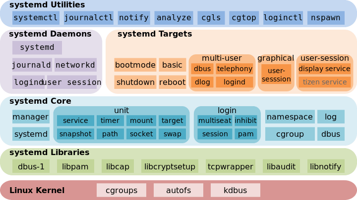

# systemd详解


* systemctl是一个systemd工具，主要负责控制systemd系统和服务管理器
* systemd是一个系统管理守护进程、工具和库的集合，用于取代System V初始进程
* systemd的功能是用于集中管理和配置类UNIX系统
* systemd 就是为了解决这些问题而诞生的。它的设计目标是，为系统的启动和管理提供一套完整的解决方案。
* 根据 Linux 惯例，字母d是守护进程（daemon）的缩写。 systemd 这个名字的含义，就是它要守护整个系统。
* 现在还有很多人反对使用 systemd，理由就是它过于复杂，与操作系统的其他部分强耦合，违反"keep simple, keep stupid"的 Unix 哲学。

## 本仓库内容

1. systemd学习笔记

```
Something I hope you know before go into the coding~
First, please watch or star this repo, I'll be more happy if you follow me.
Bug report, questions and discussion are welcome, you can post an issue or pull a request.
```

## 相关站点

* GitBook : <https://yifengyou.gitbooks.io/learn-systemd/content/>
* GitHub : <https://github.com/yifengyou/learn-systemd/>
* GitPage : <https://yifengyou.github.io/learn-systemd/>
* systemd官方站点 : <https://freedesktop.org/wiki/Software/systemd/>

## 目录

* [systemd历史](docs/systemd历史.md)
    * [init进程](docs/systemd历史/init进程.md)
    * [systemd进程](docs/systemd历史/systemd进程.md)
    * [systemd的优劣](docs/systemd历史/systemd的优劣.md)
* [systemd概述](docs/systemd概述.md)
* [systemd特点](docs/systemd特点.md)
* [systemd架构](docs/systemd架构.md)
* [systemd基本原理](docs/systemd基本原理.md)
    * [解决 socket 依赖](docs/systemd基本原理/解决socket依赖.md)
    * [解决 D-Bus 依赖](docs/systemd基本原理/解决D-Bus依赖.md)
    * [解决文件系统依赖](docs/systemd基本原理/解决文件系统依赖.md)
* [systemd基本概念](docs/systemd基本概念.md)
    * [unit基本概念](docs/systemd基本概念/unit基本概念.md)
    * [1. **service unit** 系统服务](docs/systemd基本概念/serviceunit.md)
    * [2. **target unit** 多 Unit 构成组](docs/systemd基本概念/targetunit.md)
    * [3. **device unit** 硬件设备](docs/systemd基本概念/deviceunit.md)
    * [4. **mount unit** 文件系统挂载点](docs/systemd基本概念/mountunit.md)
    * [5. **automount unit** 自动挂载点](docs/systemd基本概念/automountunit.md)
    * [6. **path unit** 文件或路径](docs/systemd基本概念/pathunit.md)
    * [7. **scope unit** 非 systemd 启动的外部进程](docs/systemd基本概念/scopeunit.md)
    * [8. **slice unit** 进程组](docs/systemd基本概念/sliceunit.md)
    * [9. **snapshot unit** 快照管理](docs/systemd基本概念/snapshotunit.md)
    * [10. **socket unit** 进程间通信的 socket](docs/systemd基本概念/socketunit.md)
    * [11. **swap unit** 交换文件管理](docs/systemd基本概念/swapunit.md)
    * [12. **timer unit** 定时器](docs/systemd基本概念/timerunit.md)
    * [Systemd事务](docs/systemd基本概念/Systemd事务.md)
* [unit配置文件](docs/unit配置文件.md)
    * [Unit区块](docs/unit配置文件/Unit区块.md)
    * [Install区块](docs/unit配置文件/Install区块.md)
    * [Service区块](docs/unit配置文件/Service区块.md)
* [systemd常见服务配置](docs/systemd常见服务配置.md)
    * [openssh配置](docs/systemd常见服务配置/openssh配置.md)
    * [vsftpd配置](docs/systemd常见服务配置/vsftpd配置.md)
    * [samba配置](docs/systemd常见服务配置/samba配置.md)
* [systemd功能](docs/systemd功能.md)
    * [系统管理](docs/systemd功能/系统管理.md)
    * [服务管理](docs/systemd功能/服务管理.md)
    * [日志管理](docs/systemd功能/日志管理.md)
* [systemd启动流程分析](docs/systemd启动流程分析.md)
    * [CentOS 8 systemd启动流程](docs/systemd启动流程分析/CentOS8systemd启动流程.md)
    * [Ubuntu 18.04 systemd启动流程](docs/systemd启动流程分析/Ubuntu1804systemd启动流程.md)
* [systemd相关命令](docs/systemd相关命令.md)
    * [systemctl**(关键命令)**](docs/systemd相关命令/systemctl.md)
    * [bootctl](docs/systemd相关命令/bootctl.md)
    * [timedatectl](docs/systemd相关命令/timedatectl.md)
    * [busctl](docs/systemd相关命令/busctl.md)
    * [hostnamectl](docs/systemd相关命令/hostnamectl.md)
    * [kernel-install](docs/systemd相关命令/kernel-install.md)
    * [localectl](docs/systemd相关命令/localectl.md)
    * [networkctl](docs/systemd相关命令/networkctl.md)
    * [loginctl](docs/systemd相关命令/loginctl.md)
    * [journalctl](docs/systemd相关命令/journalctl.md)
    * [systemd-analyze](docs/systemd相关命令/systemd-analyze.md)
    * [systemd-cat](docs/systemd相关命令/systemd-cat.md)
    * [systemd-cgls](docs/systemd相关命令/systemd-cgls.md)
    * [systemd-cgtop](docs/systemd相关命令/systemd-cgtop.md)
    * [systemd-delta](docs/systemd相关命令/systemd-delta.md)
    * [systemd-detect-virt](docs/systemd相关命令/systemd-detect-virt.md)
    * [systemd-mount](docs/systemd相关命令/systemd-mount.md)
    * [systemd-umount](docs/systemd相关命令/systemd-umount.md)
    * [systemd-path](docs/systemd相关命令/systemd-path.md)
    * [systemd-resolve](docs/systemd相关命令/systemd-resolve.md)
    * [systemd-run](docs/systemd相关命令/systemd-run.md)
    * [systemd-socket-activate](docs/systemd相关命令/systemd-socket-activate.md)
    * [systemd-stdio-bridge](docs/systemd相关命令/systemd-stdio-bridge.md)

## 参考

* <https://blog.csdn.net/weixin_30894389/article/details/95682927>
* <http://www.ruanyifeng.com/blog/2016/03/systemd-tutorial-commands.html>
* <http://www.ruanyifeng.com/blog/2016/03/systemd-tutorial-part-two.html>
* <https://www.ibm.com/developerworks/cn/linux/1407_liuming_init3/index.html>


## 小结


---

## systemd作者


* <https://en.wikipedia.org/wiki/Lennart_Poettering>

## 架构图




---
