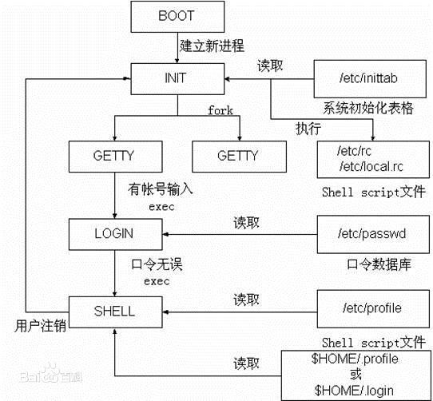

# init进程



定义:

```
描述init进程，它是内核启动的第一个用户级进程。init有许多很重要的任务，比如像启动getty（用于用户登录）、实现运行级别、以及处理孤立进程。
```

## Linux系统中，init主要有3个版本

内核启动的第一个用户空间进程是由init开始的，init主要有如下3个版本，

```
 System V init, (Sys V 传统的顺序启动init,已过时)包含目录: /etc/inittab
 Upstart, (Ubuntu使用过)包含目录: /etc/init, 包含.conf文件
 systemd, (并行按需启动，主流)包含目录: /usr/lib/systemd/; /etc/systemd/
```

* 根据 Linux 惯例，字母d是守护进程（daemon）的缩写。
* Systemd 这个名字的含义，就是它要守护整个系统。
* Systemd 是linux的系统和服务管理器。 systemd 和 SysV、LSB init scripts兼容. 它可以作为sysvinit的一个替代品。
* Systemd从开机初始化，运行过程各种服务的管理，到系统休眠，睡眠，关机。内核之上管理一切，有人形容这就是一个操作系统了。已成为大多数发行版的标配。
