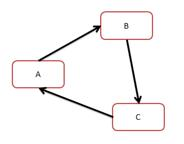

# Systemd事务

* Systemd 能保证事务完整性。
* Systemd 的事务概念和数据库中的有所不同，主要是为了保证多个依赖的配置单元之间没有环形引用。比如 unit A、B、C，假如它们的依赖关系为:

存在循环依赖，那么 systemd 将无法启动任意一个服务。

此时 systemd 将会尝试解决这个问题，因为配置单元之间的依赖关系有两种：required 是强依赖；want 则是弱依赖，systemd 将去掉 wants 关键字指定的依赖看看是否能打破循环。

如果无法修复，systemd 会报错。

Systemd 能够自动检测和修复这类配置错误，极大地减轻了管理员的排错负担。

* 类似于死锁
