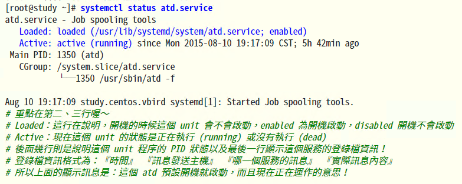
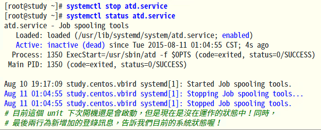
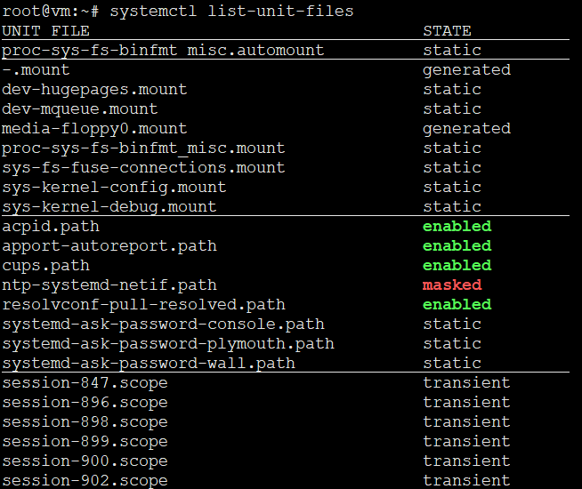

<!-- MDTOC maxdepth:6 firsth1:1 numbering:0 flatten:0 bullets:1 updateOnSave:1 -->

- [unit](#unit)   
   - [单元的概念(12个类型)](#单元的概念12个类型)   
   - [罗列所有或特定状态unit](#罗列所有或特定状态unit)   
   - [单一unit状态查看](#单一unit状态查看)   
   - [单一unit管理控制](#单一unit管理控制)   
   - [罗列单个unit的依赖](#罗列单个unit的依赖)   
   - [unit配置文件](#unit配置文件)   
   - [unit配置文件的状态](#unit配置文件的状态)   
   - [区分启动顺序与依赖关系](#区分启动顺序与依赖关系)   

<!-- /MDTOC -->
# unit

## 单元的概念(12个类型)

* 启动过程中的每一步都被 systemd 抽象为一个配置单元，即 unit。
* 可以认为一个服务是一个配置单元；一个挂载点是一个配置单元；一个交换分区的配置是一个配置单元；等等。

* systemd 将配置单元Unit归纳为以下12种。

|  类型 | 描述   |
| ------ | ---- |
| Service unit   | 系统服务。代表一个后台服务进程，比如 mysqld。这是最常用的一类。 |
| Socket Unit | 进程间通信的 socket。此类配置单元封装系统和互联网中的一个 套接字 。当下，systemd 支持流式、数据报和连续包的 AF_INET、AF_INET6、AF_UNIX socket 。每一个套接字配置单元都有一个相应的服务配置单元 。相应的服务在第一个"连接"进入套接字时就会启动(例如 nscd.socket 在有新连接后便启动 nscd.service)。 |
| Device Unit | 硬件设备。此类配置单元封装一个存在于 Linux 设备树中的设备。每一个使用 udev 规则标记的设备都将会在 systemd 中作为一个设备配置单元出现。|
| Mount Unit | 文件系统的挂载点。此类配置单元封装文件系统结构层次中的一个挂载点。Systemd 将对这个挂载点进行监控和管理。比如可以在启动时自动将其挂载；可以在某些条件下自动卸载。Systemd 会将/etc/fstab 中的条目都转换为挂载点，并在开机时处理。|
| Automount Unit | 自动挂载点。此类配置单元封装系统结构层次中的一个自挂载点。每一个自挂载配置单元对应一个挂载配置单元 ，当该自动挂载点被访问时，systemd 执行挂载点中定义的挂载行为。|
| Swap Unit | swap 文件。和挂载配置单元类似，交换配置单元用来管理交换分区。用户可以用交换配置单元来定义系统中的交换分区，可以让这些交换分区在启动时被激活。|
| Timer Unit | 定时器。用来定时触发用户定义的操作，这类配置单元取代了 atd、crond 等传统的定时服务。|
| Target unit | 多个Unit构成的一个组。它们本身实际上并不做什么，只是引用其他配置单元而已。这样便可以对配置单元做一个统一的控制。这样就可以实现大家都已经非常熟悉的运行级别概念。比如想让系统进入图形化模式，需要运行许多服务和配置命令，这些操作都由一个个的配置单元表示，将所有这些配置单元组合为一个目标(target)，就表示需要将这些配置单元全部执行一遍以便进入目标所代表的系统运行状态。 (例如 multi-user.target 相当于在传统使用 SysV 的系统中运行级别 5) |
| Snapshot Unit|Systemd 快照，可以切回某个快照 |
| Path Unit | 文件或路径|
| Scope Unit| 不是由 Systemd 启动的外部进程,来自systemd总线接口的信息。通常用于管理外部系统进程。|
| Slice Unit| 进程组,通过Linux控制组节点（cgroup）重新激活资源。|


## 罗列所有或特定状态unit


列出正在运行的 Unit

```
$ systemctl list-units
```

列出所有Unit，包括没有找到配置文件的或者启动失败的

```
$ systemctl list-units --all
```

列出所有没有运行的 Unit

```
$ systemctl list-units --all --state=inactive
```

列出所有加载失败的 Unit

```
$ systemctl list-units --failed
```

列出所有正在运行的、类型为 service 的 Unit

```
$ systemctl list-units --type=service
```


## 单一unit状态查看

```
[root@study ~]# systemctl [command] [unit]
command 主要有：
status    ：目前後面接的這個 unit 的狀態，會列出有沒有正在執行、開機預設執行否、登錄等資訊等！
is-active ：目前有沒有正在運作中
is-enabled：開機時有沒有預設要啟用這個 unit
is-failed：启动失败的 unit
```


显示系统状态
```
$ systemctl status
```





显示单个 Unit 的状态
```
$ sysystemctl status bluetooth.service
```

除了status命令，systemctl还提供了三个查询状态的简单方法，主要供脚本内部的判断语句使用。
显示某个 Unit 是否正在运行
```
$ systemctl is-active application.service
```

显示某个 Unit 是否处于启动失败状态
```
$ systemctl is-failed application.service
```

显示某个 Unit 服务是否建立了启动链接
```
$ systemctl is-enabled application.service
```

## 单一unit管理控制


```
[root@study ~]# systemctl [command] [unit]
command 主要有：
start     ：立刻啟動後面接的 unit
stop      ：立刻關閉後面接的 unit
restart   ：立刻關閉後啟動後面接的 unit，亦即執行 stop 再 start 的意思
reload    ：不關閉後面接的 unit 的情況下，重新載入設定檔，讓設定生效
enable    ：設定下次開機時，後面接的 unit 會被啟動
disable   ：設定下次開機時，後面接的 unit 不會被啟動
```

对于用户来说，最常用的是下面这些命令，用于启动和停止 Unit（主要是 service）。

立即启动一个服务
```
$ sudo systemctl start apache.service
```

立即停止一个服务
```
$ sudo systemctl stop apache.service
```

重启一个服务
```
$ sudo systemctl restart apache.service
```

杀死一个服务的所有子进程
```
$ sudo systemctl kill apache.service
```

重新加载一个服务的配置文件
```
$ sudo systemctl reload apache.service
```

重载所有修改过配置文件的单元，**凡是修改过unit配置的都要经过此步骤**
```
$ sudo systemctl daemon-reload
```

显示某个 Unit 的所有底层参数
```
$ systemctl show httpd.service
```

显示某个 Unit 的指定属性(property)的值
```
$ systemctl show -p CPUShares httpd.service
```

设置某个 Unit 的指定属性(property)
```
$ sudo systemctl set-property httpd.service CPUShares=500
```

## 罗列单个unit的依赖


* systemd 的配置单元之间可以彼此定义依赖关系。
比如：unit A 依赖 unit B (unit B 依赖于 unit A)，可以在 unit B 的定义中用"require A"来表示。这样 systemd 就会保证先启动 A 再启动 B。

systemctl list-dependencies命令列出一个 Unit 的依赖**(不一定是所有)**。

```
$ systemctl list-dependencies nginx.service
```

上面命令的输出结果之中，有些依赖是 Target 类型（详见下文），默认不会展开显示。如果要展开 Target，就需要使用--all参数。

```
$ systemctl list-dependencies --all nginx.service
```

## unit配置文件

* 每个配置单元都有一个对应的配置文件，告诉 Systemd 怎么启动这个 Unit 。
* Systemd 默认从目录/etc/systemd/system/读取配置文件。但是，里面存放的大部分文件都是符号链接，(开机启动的部分)
* 指向目录/usr/lib/systemd/system/，真正的配置文件存放在那个目录。
* systemctl enable命令用于在上面两个目录之间，建立符号链接关系。disable则是相反，删除符号链接，撤销开机启动。
* 配置文件的后缀名，就是该 Unit 的种类，比如sshd.socket。如果省略，Systemd 默认后缀名为.service，所以sshd会被理解成sshd.service。

```
/etc/systemd/system
/run/systemd/system
/usr/lib/systemd/system
```

## unit配置文件的状态


列出所有配置文件
```
$ systemctl list-unit-files
```



## 区分启动顺序与依赖关系

Unit区块的Description字段给出当前服务的简单描述，Documentation字段给出文档位置。

接下来的设置是启动顺序和依赖关系，这个比较重要。

* After字段：表示如果network.target或sshd-keygen.service需要启动，那么sshd.service应该在它们之后启动。

相应地，还有一个Before字段，定义sshd.service应该在哪些服务之前启动。

注意，**After和Before字段只涉及启动顺序，不涉及依赖关系。**

举例来说，某 Web 应用需要 postgresql 数据库储存数据。在配置文件中，它只定义要在 postgresql 之后启动，而没有定义依赖 postgresql 。上线后，由于某种原因，postgresql 需要重新启动，在停止服务期间，该 Web 应用就会无法建立数据库连接。

设置依赖关系，需要使用Wants字段和Requires字段。

* Wants字段：表示sshd.service与sshd-keygen.service之间存在"**弱依赖**"关系，即如果"sshd-keygen.service"启动失败或停止运行，不影响sshd.service继续执行。
* Requires字段则表示"**强依赖**"关系，即如果该服务启动失败或异常退出，那么sshd.service也必须退出。

注意，Wants字段与Requires字段只涉及依赖关系，与启动顺序无关，默认情况下是同时启动的。


怎么感觉英语单词里这两个意思刚好相反？？？

```
want : 侧重缺少某种必需之物，或个人渴望得到的东西。
require : 使用广泛，语气较轻。强调急需时可与need换用，但有时暗示所需的人或物是完成某一任务必不可少的。
```

```
want 用户主动需求（用户希望，但要求反馈的意愿没那么强）
need 用户潜在需求（根据分析判断出的"用户需要什么"）
demand 用户主动强需求（用户强烈希望且要求得到反馈）
requirement 用户请求（请求通常会按照一些预定的标准格式进行填写，且一般在提交请求后要求能够在限定时间内得到响应，如用户提交支付请求，系统需要响应用户，告知请求被许可或者不被许可
```


---


---
