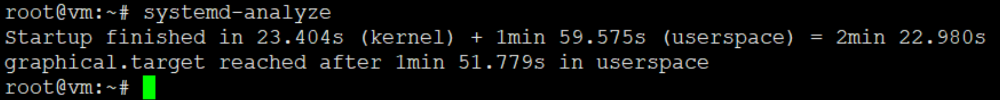
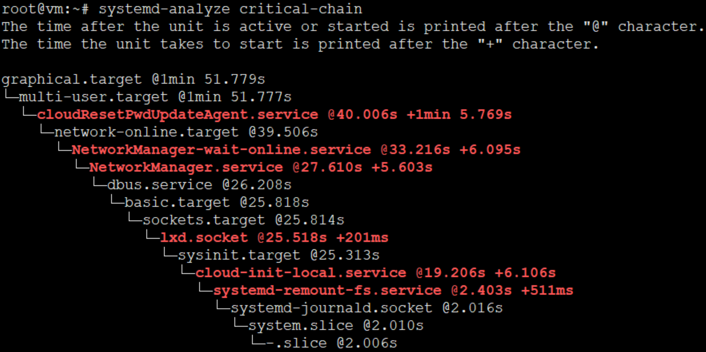
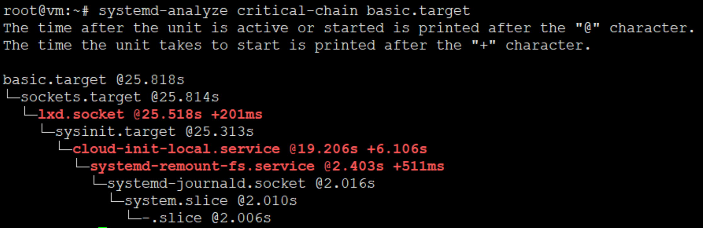

# systemd-analyze

systemd-analyze命令用于查看启动耗时。

## 查看启动耗时

```
$ systemd-analyze
```



## 查看每个服务的启动耗时

```
$ systemd-analyze blame
```

```
root@vm:~# systemd-analyze
Startup finished in 23.404s (kernel) + 1min 59.575s (userspace) = 2min 22.980s
graphical.target reached after 1min 51.779s in userspace
root@vm:~# systemd-analyze  blame
    1min 11.971s cloudResetPwdAgent.service
     1min 5.769s cloudResetPwdUpdateAgent.service
         53.859s cloud-init.service
         15.604s cloud-config.service
         14.105s dev-vda1.device
          8.994s lxd-containers.service
          7.994s networkd-dispatcher.service
          7.791s cloud-final.service
          6.107s udisks2.service
          6.106s cloud-init-local.service
          6.095s NetworkManager-wait-online.service
          5.652s motd-news.service
          5.603s NetworkManager.service
          4.307s ModemManager.service
          3.704s multi-queue-hw.service
          3.691s apparmor.service
          3.598s wpa_supplicant.service
          2.701s systemd-modules-load.service
          2.698s rsyslog.service
          2.502s accounts-daemon.service
          2.492s avahi-daemon.service
          2.490s networking.service
          2.488s systemd-logind.service
          2.402s apport.service
          2.204s ssh.service
          2.197s gpu-manager.service
          2.171s keyboard-setup.service
          2.101s gdm.service
          2.005s pppd-dns.service
          1.795s speech-dispatcher.service
          1.695s packagekit.service
          1.510s systemd-udev-trigger.service
          1.297s user@127.service
          1.095s bolt.service
           922ms apt-daily.service
           794ms kerneloops.service
           695ms polkit.service
           636ms apt-daily-upgrade.service
           603ms ebtables.service
           599ms colord.service
           596ms chrony.service
           578ms dev-hugepages.mount
           511ms systemd-remount-fs.service
           505ms kmod-static-nodes.service
           497ms systemd-tmpfiles-setup-dev.service
           490ms systemd-tmpfiles-setup.service
           411ms systemd-sysctl.service
           403ms upower.service
           401ms blk-availability.service
           392ms plymouth-read-write.service
           305ms selinux-autorelabel-mark.service
           298ms systemd-update-utmp.service
           297ms dns-clean.service
           243ms snapd.seeded.service
           227ms snapd.service
           207ms user@0.service
           206ms console-setup.service
           203ms sys-kernel-debug.mount
           201ms lxd.socket
           197ms dev-mqueue.mount
           196ms setvtrgb.service
           195ms rtkit-daemon.service
           194ms systemd-user-sessions.service
           193ms ufw.service
           188ms resolvconf.service
           108ms systemd-update-utmp-runlevel.service
           104ms proc-sys-fs-binfmt_misc.mount
            71ms fstrim.service
            69ms systemd-resolved.service
            43ms grub-common.service
            41ms systemd-journald.service
            27ms systemd-tmpfiles-clean.service
            26ms systemd-udevd.service
            20ms resolvconf-pull-resolved.service
            16ms lvm2-monitor.service
            11ms sys-fs-fuse-connections.mount
            11ms systemd-journal-flush.service
            10ms sys-kernel-config.mount
             9ms systemd-random-seed.service
             6ms plymouth-quit-wait.service
             3ms snapd.socket
```

## 显示瀑布状的启动过程流

```
$ systemd-analyze critical-chain
```



## 显示指定服务的启动流

```
$ systemd-analyze critical-chain atd.service
```




## 参考

* <http://www.jinbuguo.com/systemd/systemd-analyze.html>


---
