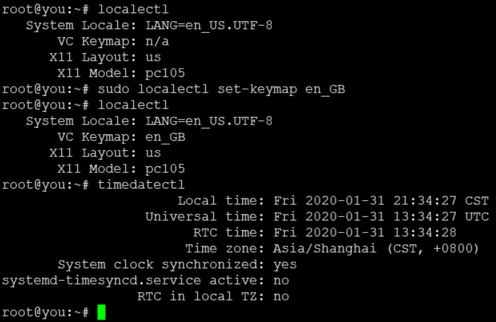
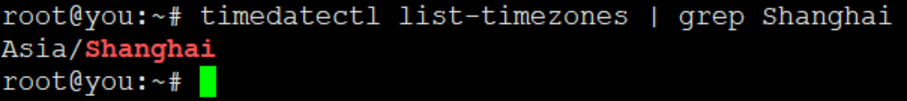

# timedatectl

timedatectl命令用于查看当前时区设置

## 查看当前时区设置

```
$ timedatectl
```



## 显示所有可用的时区
```
$ timedatectl list-timezones
```

 

## 设置当前时区

```
$ sudo timedatectl set-timezone America/New_York
$ sudo timedatectl set-time YYYY-MM-DD
$ sudo timedatectl set-time HH:MM:SS
```
